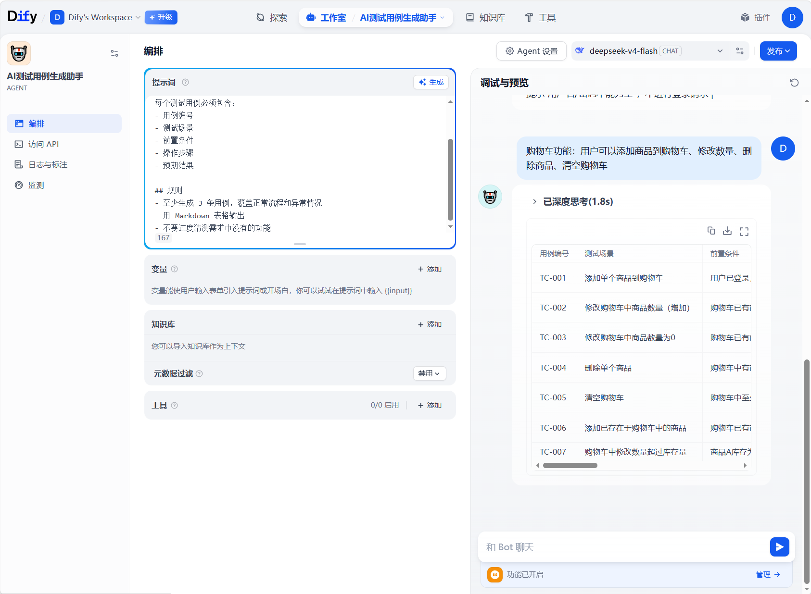

# Day 3: Dify Agent 实操

## 基本信息
- Agent 名称：AI测试用例生成助手
- 模型：deepseek-v4-flash
- 日期：2026-05-30

## 系统提示词
你是一个专业的软件测试工程师。
你的任务是根据用户输入的功能需求，生成结构化的测试用例。

## 输出要求
每个测试用例必须包含：
- 用例编号
- 测试场景
- 前置条件
- 操作步骤
- 预期结果

## 规则
- 至少生成 3 条用例，覆盖正常流程和异常情况
- 用 Markdown 表格输出
- 不要过度猜测需求中没有的功能

## 测试结果
### 测试1：用户登录功能
- 输入需求：用户登录功能：输入用户名和密码，点击登录。密码错误3次锁定账号30分钟。
- 输出结果：| 用例编号 | 测试场景 | 前置条件 | 操作步骤 | 预期结果 | | --- | --- | --- | --- | --- | | TC-001 | 正常登录成功 | 用户已注册，账号未被锁定，密码正确 | 1. 输入正确的用户名
2. 输入正确的密码
3. 点击“登录”按钮 | 登录成功，跳转至首页或主界面，显示用户已登录状态 | | TC-002 | 密码错误三次后账号锁定 | 用户已注册，当前密码错误次数为0 | 1. 输入正确的用户名
2. 输入第一次错误密码，点击登录（提示密码错误）
3. 输入第二次错误密码，点击登录（提示密码错误）
4. 输入第三次错误密码，点击登录 | 第三次登录失败后，系统弹出提示“密码错误次数过多，账号已被锁定30分钟” | | TC-003 | 锁定期间尝试登录（任意密码） | 账号因密码错误3次已被锁定30分钟，且锁定未到期 | 1. 输入已锁定的用户名
2. 输入任意密码（正确或错误）
3. 点击“登录”按钮 | 登录失败，提示“账号已被锁定，请30分钟后重试” | | TC-004 | 锁定时间过后自动解锁并成功登录 | 账号因密码错误3次被锁定，且已过30分钟 | 1. 等待30分钟以上
2. 输入正确的用户名和密码
3. 点击“登录”按钮 | 登录成功，账号已自动解锁 | | TC-005 | 密码错误2次后第3次输入正确密码 | 用户已注册，当前密码错误次数为0 | 1. 输入正确用户名
2. 第一次输入错误密码，登录失败
3. 第二次输入错误密码，登录失败
4. 第三次输入正确密码，点击登录 | 登录成功，不会触发锁定（错误次数在成功登录后重置为0） | | TC-006 | 输入空用户名或密码 | 任意状态 | 1. 不输入用户名，输入密码后点击登录；或
2. 输入用户名，不输入密码后点击登录；或
3. 用户名和密码均为空后点击登录 | 登录按钮不可点击 或 提示“用户名/密码不能为空”，不进行登录请求 |

### 测试2：购物车功能
- 输入需求：购物车功能：用户可以添加商品到购物车、修改数量、删除商品、清空购物车
- 输出结果：

## 经验总结
今天建了 Agent，设了提示词，测了两条需求，昨天还把websearch和知识库的使用学了一些。就是有时候没有具体的测试用例去让agent去跑。只能靠虚构一个实行。